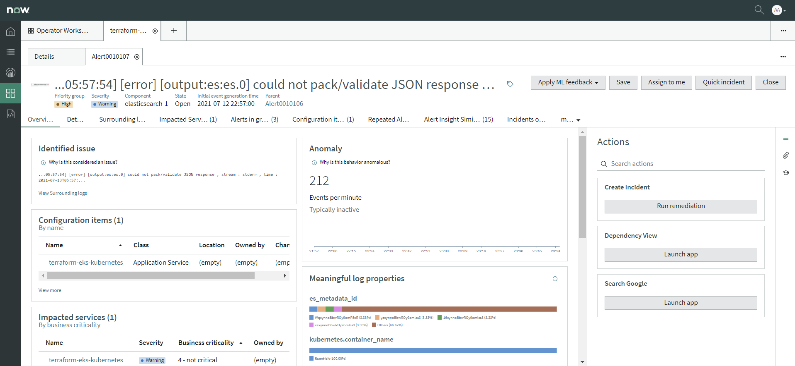

Health Log Analytics Bootcamp 2021

# Prerequisites

* [Install EKS on AWS](https://github.com/pangealab/uranus)
* [Install Boutique on EKS](https://github.com/pangealab/helios)
* [Install ELK on AWS](https://github.com/pangealab/nemesis)
* [Install Fluentbit on EKS](https://github.com/pangealab/phobos)

# Request NOW Instance

* [Request NOW Instance](docs/content/request-now-instance.md)

# Install MID on AWS

* [Install MID on AWS](https://github.com/pangealab/tyche)

# Install HLA on NOW

* [Install HLA on NOW](docs/content/install-hla-on-now.md)

# Trigger Anomaly

# Detect Anomaly