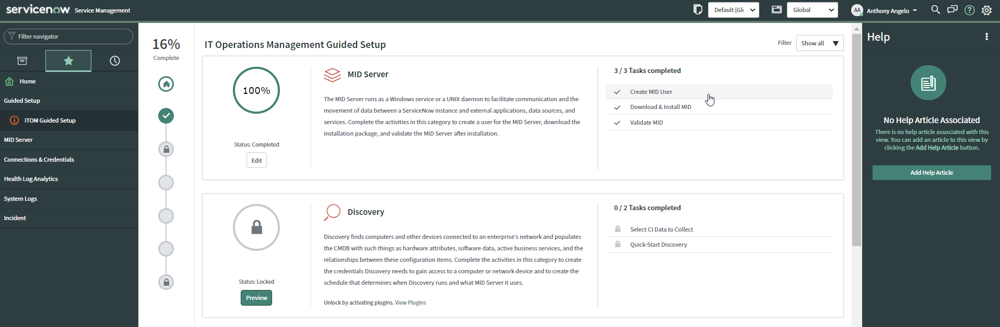

# Prerequisites

* NOW ID

# Request NOW Instance

* Navigate to https://support.servicenow.com

* Login using your `NOW ID`

* Request a `New Internal Instance Request`

* After instance has been provisioned, safeguard your URL and `admin` credentials

# Create MID Server User

* Login to NOW using your `admin` credentials

* Navigate to the `Guided Setup > ITOM Guided Setup` Screen

* Create a `MID User` as follows and safeguard credentials

    